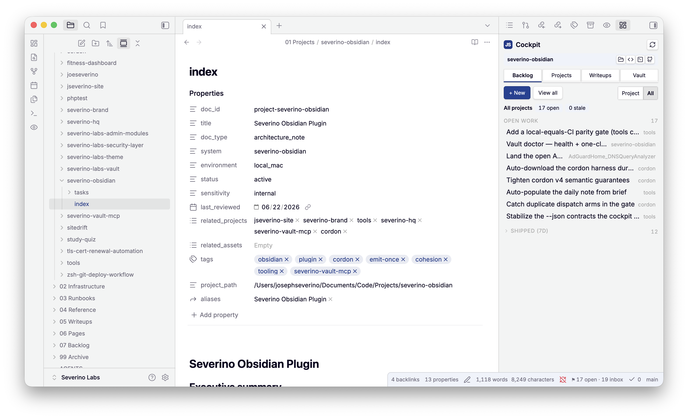
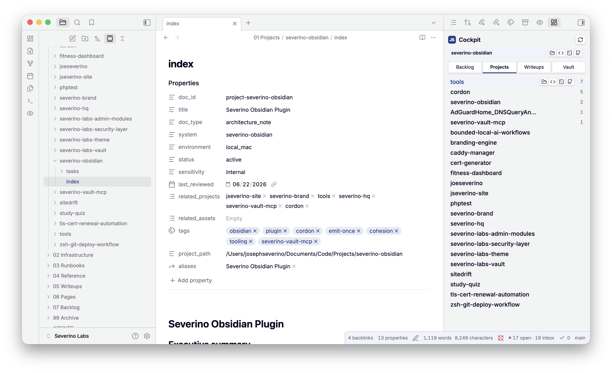
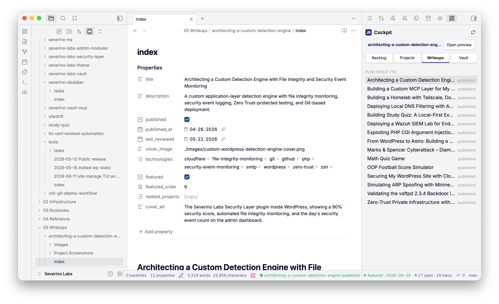
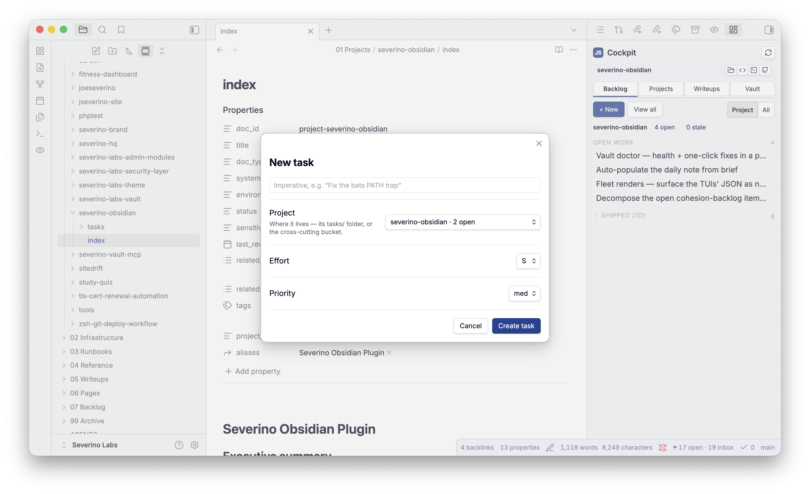
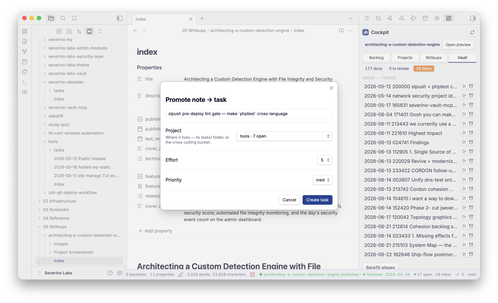
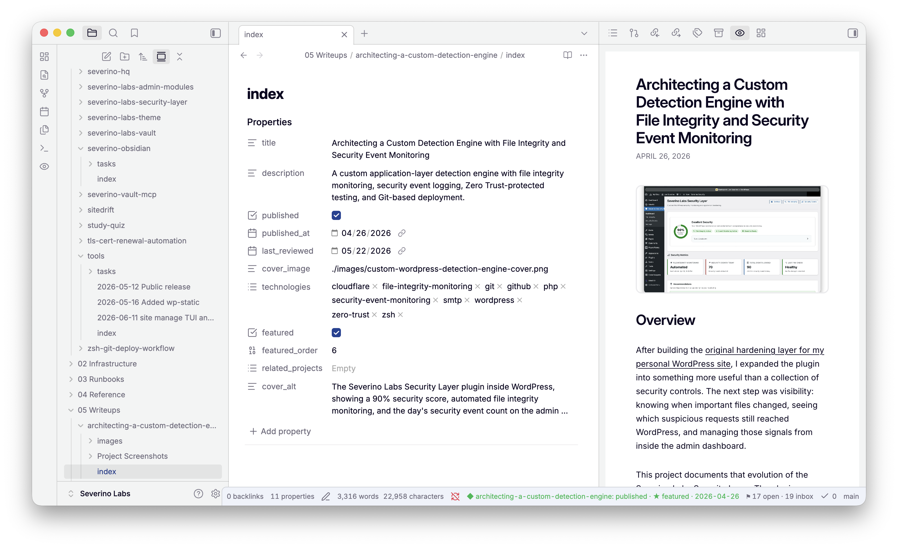
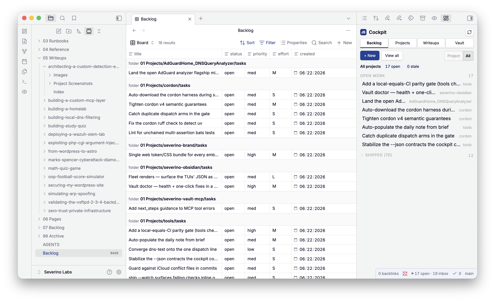

# severino-obsidian

The **editor-side cockpit** for the Severino Labs vault — an Obsidian plugin that
turns the vault into a working surface for the whole fleet: a backlog cockpit,
task capture and triage, project launchers, and a site-accurate writeup preview.

It is built on one rule — **own nothing but the UI**. The hard parts already have
owners; this plugin renders them and delegates to them, so it can grow without
becoming a second source of truth. The full design is in
**[docs/ARCHITECTURE.md](docs/ARCHITECTURE.md)**.

| Concern | Owner (single source of truth) | How the plugin uses it |
|---|---|---|
| task logic, schema, search, the one writer | [`severino-vault-mcp`](https://github.com/joeseverino/severino-vault-mcp) (the MCP) | shells out to its CLI subcommands |
| markdown→HTML + the `::figure`/`::table`/`::terminal` DSL | [`jseverino.com`](https://github.com/joeseverino/jseverino.com)`/src/lib/markdown.ts` | imports `renderWriteupHtml` (esbuild alias) |
| brand tokens + writeup CSS + the JS mark | [`severino-brand`](https://github.com/joeseverino/severino-brand) → site `base.css` / `mark.svg` | bundled from source at build time |

If a feature would re-implement an owner's piece, it's out by design.

## What it does

**The cockpit** (a brand-skinned side panel — ribbon `▦` or `Cockpit: open`):

- **Backlog** — open work + a collapsible *Shipped (7d)* feed, **scoped to the
  project you're in** (Project / All toggle). `+ New` opens the task modal;
  `View all` opens the native `Backlog.base`.
- **Projects** — every project with its open-task count and **launch buttons**
  (Finder · VS Code · iTerm · GitHub), revealed on hover.
- **Writeups** — drafts and published, from the site pipeline.
- **Vault** — health (docs to review, inbox) + **inbox triage** (promote → task /
  archive) + a one-click alias fix.
- A status-bar badge (`open · stale · inbox`) and a context bar that reacts to the
  active file (a writeup → *Open preview*, a project → launch).

**Task & vault commands** — all thin over the MCP:

- **New task** / **Promote inbox note to a task** — capture, validated and filed
  by the MCP (`task-add` / `promote-note`).
- **Edit relations** — set `related_projects` from the live registry and
  status/sensitivity from the schema enums (writes via `update-frontmatter`).
- **Ask the vault** — the MCP's runbook search through Obsidian's quick-switcher.

**Writeup authoring** — the original surface, still here:

- **Site preview** — a sandboxed iframe rendering the active writeup exactly as
  `jseverino.com` will, using the site's own renderer + `base.css`.
- **Publish gate**, **asset doctor**, **graphics render**, **schema check**,
  **sync to site**, **DSL inserts**, **open on site / copy slug**.

## Screenshots

The cockpit, scoped to the project you're in — open work plus a *Shipped (7d)*
feed, all derived live from the MCP:



| Projects — open counts + launch buttons | Writeups — drafts and published |
|---|---|
|  |  |

| New task (MCP-validated) | Promote an inbox note to a task |
|---|---|
|  |  |

The **site-accurate writeup preview** — the active note rendered exactly as
`jseverino.com` will, using the site's own renderer and `base.css`:



The same `task-list` the cockpit reads, as the native `Backlog.base` board —
close a task anywhere and all faces agree:



## Quick start

```sh
npm install
npm run build        # bundles into <vault>/.obsidian/plugins/severino-obsidian/

# overrides (same pattern as severino-brand/sync.mjs)
SITE_DIR=/path/to/jseverino.com VAULT_DIR="/path/to/Severino Labs" npm run build
```

Then in Obsidian: **Settings → Community plugins → enable "Severino Labs"**, and
open the cockpit from the ribbon. The CLIs it shells out to
(`severino-vault-mcp`, `site`, `brand`, `diagram`) must be on `~/.local/bin`.

## Develop

```sh
npm run dev             # watch-rebuild into the vault
npm run typecheck       # tsc --noEmit
npm run commands:emit   # regenerate the cordon command contract after editing src/commands.mjs
```

The command surface is declared once in `src/commands.mjs` and rendered into the
live commands, the cordon-v4 contract (`contract/obsidian-commands.json`), and the
reference below — they cannot drift. Each command carries its `effect`
(`read < local_write < vault_write < remote_write < deploy`) and the fleet command
it delegates to.

- **Architecture:** [docs/ARCHITECTURE.md](docs/ARCHITECTURE.md)
- **Cornerstones / governance:** [docs/CORNERSTONES.md](docs/CORNERSTONES.md)

## Governance

The command surface is derived from `package.json` scripts via the cordon emitter
(`bin/severino-obsidian`); regenerate after a scripts change with
`npm run describe:write`. The reference below is rendered from the contract by
`scripts/gen-readme.mjs` and gate-checked — don't hand-edit it.

<!-- BEGIN GENERATED: cli-reference (scripts/gen-readme.mjs — do not edit by hand) -->

### `severino-obsidian`

effect: `read`

Obsidian plugin suite for the vault: site-accurate writeup preview + authoring power-ups.

**Commands**

| command | effect | summary |
|---|---|---|
| `build` | `local_write` | Bundle the plugin into the vault (site renderer + base.css inlined). |
| `dev` | `local_write` | Watch-rebuild into the vault on change. |
| `typecheck` | `read` | Type-check the source with tsc --noEmit. |
| `commands:emit` | `local_write` | Render the cordon-v4 command contract from src/commands.mjs. |
| `commands:check` | `read` | Fail if the committed command contract is stale. |

---

### `severino-obsidian-commands`

effect: `read`

Severino Labs Obsidian plugin — in-editor command surface.

**Commands**

| command | effect | summary |
|---|---|---|
| `open-site-preview` | `read` | Site preview: open pane — Open the site-accurate writeup preview pane. |
| `publish-gate` | `read` | Publish gate: check this writeup — Run the MCP validate-writeup gate (draft mode). |
| `asset-doctor` | `read` | Asset doctor: check images for orphans + missing — Report orphaned and missing writeup images. |
| `insert-figure` | `local_write` | Insert figure block — Insert a ::figure DSL skeleton at the cursor. |
| `insert-table` | `local_write` | Insert table block — Insert a ::table DSL skeleton at the cursor. |
| `insert-terminal` | `local_write` | Insert terminal block — Insert a ::terminal DSL skeleton at the cursor. |
| `graphics-status` | `read` | Graphics: status (unrendered sources) — List graphics sources vs rendered images. |
| `graphics-render` | `local_write` | Graphics: render unrendered into images/ — Render graphics via brand/diagram into images/. |
| `sync-to-site` | `vault_write` | Sync writeups to the site repo — Run `site sync` (vault → site repo). |
| `schema-check` | `read` | Schema: check this doc’s frontmatter — Lint frontmatter against the MCP schema. |
| `open-on-site` | `read` | Open writeup on jseverino.com — Open the live writeup URL in the browser. |
| `copy-slug` | `read` | Copy writeup slug — Copy the active writeup slug to the clipboard. |
| `new-task` | `vault_write` | New task — Create a task (title + project picker) via the MCP, then open it. |
| `open-cockpit` | `read` | Cockpit: open — Open the fleet cockpit panel (backlog + stale debt, derived from the MCP). |
| `ask-the-vault` | `read` | Ask the vault — Quick-switcher over the MCP find_runbook ranking; opens the hit. |
| `edit-relations` | `vault_write` | Edit relations — Edit related_projects + status/sensitivity from the registry/schema; writes via the MCP. |
| `promote-note` | `vault_write` | Promote inbox note to a task — Promote the active inbox note into a task (body preserved) via the MCP, then open it. |
| `autopopulate-daily` | `vault_write` | Daily note: populate brief region — Fill today’s daily-note brief region (work to ship, review-due, stale backlog, drafts) via `vault daily`. Also fires once when today’s daily note opens. |

<!-- END GENERATED: cli-reference -->

## License

[MIT](LICENSE) © Joe Severino
